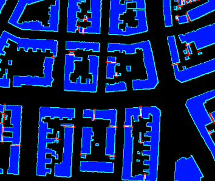
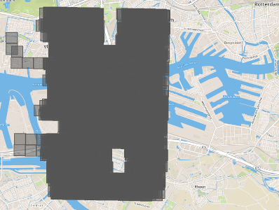

1.  **Introduction**

Tell us a bit about yourself, and why you have decided to participate
in the contest.

-   Name: Selim Seferbekov

-   Handle: selim_sef

-   Placement you achieved in the MM:

-   About you: During the day I'm a Machine Learning Engineer working on
    projects aimed to improve maps. As a hobby a participate in a lot
    of competitions related to Deep Learning (mostly Computer Vision).

-   Why you participated in the MM: I participated in all Spacenet
    challenges starting from Spacenet 3. I would not have an excuse to
    miss this one.

2.  **Solution Development**

How did you solve the problem? What approaches did you try and what
choices did you make, and why? Also, what alternative approaches did
you consider?

-   I solved the task using the same approach as in the winning solution
    of Data Science Bowl 2018
    https://www.kaggle.com/c/data-science-bowl-2018/discussion/54741.
    Which basically has encoder decoder network like UNet and
    watershed post processing but instead of predicting just binary
    masks the CNN predicted 3 masks: (body mask, separations between
    buildings, building contours). This helped to separate buildings
    much better than the simple watershed
    approach.{width="4.911117672790901in"
    height="4.119792213473316in"}

-   At first I used a random split for validation holdout. The gap
    between leaderboard and validation was huge \~40%. That is a clear
    sign of train data leak to validation. After visualization of the
    tiles by their coordinates I saw that there were \~15 passes over
    each location and I prepared a small holdout southeastern part of
    train data.{width="5.5322922134733155in"
    height="4.161458880139983in"}

-   As the data contained speckle noise I decided to combat that with
    heavy multiscale test time augmentations (6 scales). The
    predictions from each scale were quite different and it boosted F1
    by 3%.

-   I also tried instance segmentation approach with Cascade-RCNN which
    worked really great on RGB data but produced poor results on SAR
    images (F1 was around 0.32)

3.  **Final Approach**

Please provide a bulleted description of your final approach. What
ideas/decisions/features have been found to be the most important for
your solution performance:

-   I used EfficientNet B5, DPN92, ResneX101 as encoders for semantic
    segmentation

-   To have better batch size/bigger crop I trained all models with
    Nvidia Apex in mixed precision. That allowed to train 16 models in
    the given time.

-   Preprocessing: images were converted to 0-255 scale

-   As a loss function I used combination of soft dice loss + binary
    cross entropy. BCE was more stable than focal loss in mixed
    precision mode.

-   Augmentations: as the amount of data (geographically) was quite
    small I applied affine transformations to reduce overfitting.

-   Test time augmentations (TTA): used 864, 928, 1024, 1088, 1152, 1280
    input sizes

4.  **Open Source Resources, Frameworks and Libraries**

Please specify the name of the open source resource along with a URL
to where it's housed and it's license type:

-   Docker, https://www.docker.com (Apache License 2.0)

-   Nvidia-docker, https://github.com/NVIDIA/nvidia-docker, ( BSD
    3-clause)

-   Python 3, https://www.python.org/, ( PSFL (Python Software
    Foundation License))

-   Numpy, http://www.numpy.org/, (BSD)

-   Tqdm, https://github.com/noamraph/tqdm, ( The MIT License)

-   Anaconda, https://www.continuum.io/Anaconda-Overview,( New BSD
    License)

-   OpenCV, https://opencv.org/ (BSD)

-   Pytorch https://pytorch.org/ (BSD)

5.  **Potential Algorithm Improvements**

Please specify any potential improvements that can be made to the
algorithm:

-   Foreshortening, Layover should be addressed somehow to improve
    detection quality.

6.  **Algorithm Limitations**

Please specify any potential limitations with the algorithm:

-   Because SAR is side looking tall buildings are not segmented
    properly. Even medium rise buildings are often shifted far from
    the ground truth mask.

-   Very small buildings are not detected at all as due to speckle noise
    they cannot be distinguished.
